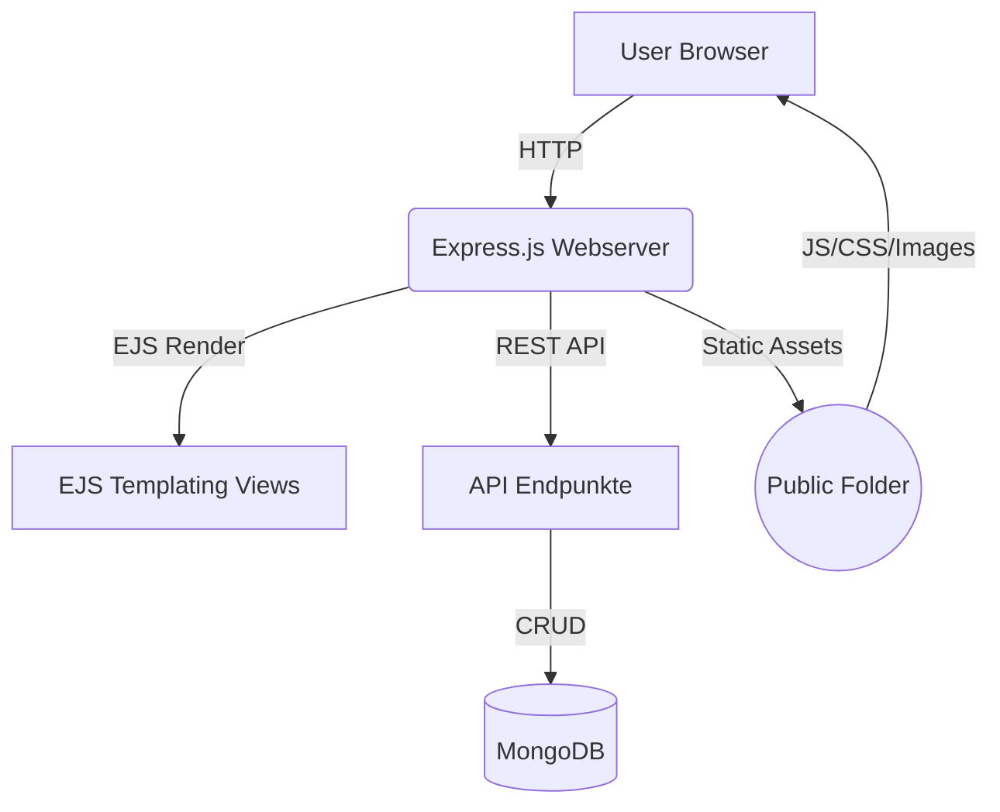

# dbiBlog


---

## Inhaltsverzeichnis
- [Über das Projekt](#über-das-projekt)
- [Features](#features)
- [Architektur](#architektur)
- [Screenshots](#screenshots)
- [Schnellstart](#schnellstart)
- [API-Übersicht](#api-übersicht)
- [Mitwirken](#mitwirken)
- [Roadmap](#roadmap)
- [FAQ](#faq)
- [Kontakt](#kontakt)

---

## Über das Projekt

dbiBlog ist eine moderne Blogging-Plattform mit Express, MongoDB und EJS. Sie unterstützt mehrere Nutzer, Kategorien, Kommentare und Markdown-Inhalte.

> #### 🚩 **Kurzdemo/Animation:**
> 

---

## Features
- Einfache Nutzerverwaltung
- Verschachtelte Kategorien
- Kommentare & Markdown fähig
- Übersichtlich gegliederte API für Einträge, Nutzer, Kommentare etc.
- EJS-Frontend (kann erweitert/adaptiert werden)

---

## Architektur



---

## Screenshots

> **Hauptseite:**
> 

> **Blog-Details:**
> 

---

## Schnellstart

```shell
# Repository klonen
$ git clone https://github.com/deinname/dbiBlog.git
$ cd dbiBlog/blog

# Abhängigkeiten installieren
$ npm install

# (Optional) Datenbank seedn
$ npm run seed

# Server starten
$ npm start
```
> Standardmäßig öffnet sich die App auf http://localhost:3000

---

## API-Übersicht

| Methode | Pfad             | Beschreibung           |
|---------|------------------|-----------------------|
| GET     | /                | Blog Übersicht        |
| GET     | /entry/:id       | Detailansicht Eintrag |
| POST    | /entry           | Blogeintrag erstellen |
| ...     | ...              | (Weitere Endpunkte)   |

> Ausführliche API-Doku folgt oder auf Anfrage

---

## Mitwirken

Beiträge und Verbesserungen willkommen! 
Schau dir [CONTRIBUTING.md](CONTRIBUTING.md) und die offenen Issues an oder erstelle einen eigenen Pull Request.

1. Fork das Repo
2. Erstelle einen Feature-Branch (`git checkout -b feature/FooBar`)
3. Committe deine Änderungen (`git commit -m 'Add FooBar'`)
4. Push zum Branch (`git push origin feature/FooBar`)
5. Stelle einen Pull Request!

---

## Roadmap
- [ ] Auth mit OAuth
- [ ] Responsive Redesign
- [ ] Mehrsprachigkeit
- [ ] REST API Docs automatisieren

---

## FAQ

**Wie kann ich einen neuen Nutzer anlegen?**  
Registriere dich über die Web-Oberfläche oder lege direkt in MongoDB einen User an.

**Wie kann ich eigene Kategorien hinzufügen?**  
Über die Admin-Ansicht oder per Datenbank/REST API.

**Wo finde ich weitere Hilfe?**  
[GitHub Issues](https://github.com/deinname/dbiBlog/issues) oder Kontakt unten.

---

## Kontakt

Paul Muster – paul@email.com  
Projekt-Link: [github.com/deinname/dbiBlog](https://github.com/deinname/dbiBlog)

---

> 🚧 **Hinweis:** Alle Bild-/Diagramm-Platzhalter können einfach durch eigene Screenshots oder Illustrationen im Ordner `images/` ersetzt werden.
